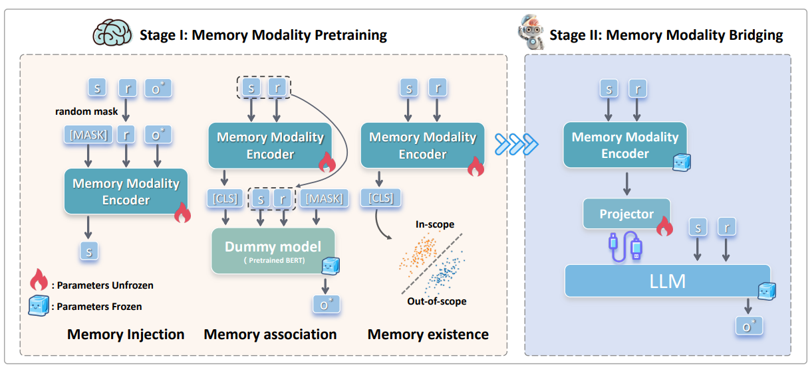

# MindBridge

- Code for the paper `MindBridge: Scalable and Cross-Model Knowledge Editing via Memory-Augmented Modality`.

## Overview



**MindBridge** is a novel and scalable cross-model knowledge editing method designed to overcome the limitations of
existing approaches. Current knowledge editing methods often suffer from overfitting to individual models. This leads to
edited knowledge being discarded and necessitates frequent re-editing whenever models are updated.

To address this issue, MindBridge introduces the concept of **memory modality**. This innovative approach allows edited
knowledge to be effectively transferred across different models, transcending the constraints of single-model editing.

MindBridge operates in two stages:

- **Stage I: Memory Modality Pre-training** - This stage focuses on training a memory modality encoder using three
  objectives: memory injection, memory association, and memory existence. This encoder is designed to retain, associate,
  and verify the existence of relevant memories.
- **Stage II: Memory Modality Bridging** - A projector is trained to bridge the memory modality encoder with Large
  Language Models (LLMs). This enables LLMs to access and utilize the knowledge stored within the memory modality
  effectively.

Extensive experiments conducted on popular knowledge editing datasets and with various LLMs demonstrate the
effectiveness and scalability of MindBridge.

## **Setup**

This codebase uses Python 3.9, you can create a conda env:

```bash
conda create -n mindbridge python=3.9

conda activate mindbridge

pip install -r requirements.txt
```

The datasets ZsRE and Counterfact have already been prepared in the `./data` directory.

## Quick Start

### Stage I: Memory Modality Pre-training

The code for MindBridge is located in the `mindbridge` folder. To run Stage 1, you need to modify the configuration file
for training Stage 1 at `./config/stage_i.yaml`, and then execute the following command:

```bash
cd mindbridge
python run_stage_i.py --config_file ./config/stage_i.yamls
```

The trained memory modality encoder will be saved in the `./results/pretrain` directory, and each experiment will
generate an `exp_id`.

### Stage II: Memory Modality Pre-training

To run Stage 2, you need to modify the configuration file for training Stage 2 at `./config/stage_ii.yaml`, updating the
`memory_exp_id` field with the `exp_id` corresponding to the model trained in Stage 1, and then execute the following
command:

```bash
python run_stage_ii.py --config_file ./config/stage_ii.yaml
```

The trained memory modality encoder will be saved in the `./results/bridge` directory, and an `exp_id` will be generated
simultaneously.

### Evaluate MindBridge

The testing code is based on [EasyEdit](https://github.com/zjunlp/EasyEdit/tree/main). To test MindBridge, you need to run the following code, where `exp_id` corresponds to the `exp_id` generated after training in Stage ii.

```
cd ./EasyEdit/examples
python evaluate_mindbridge.py --exp_id $this_is_exp_id$ 
```

### Evaluation of Baseline Methods

For testing other baseline methods, the implementation from EasyEdit is also used. Please refer to other `.py` files in
`EasyEdit/examples` for details.

